# SPRING PLUS

### 1. 코드 개선 퀴즈 - @Transactional의 이해 
- TodoService의 saveTodo 메서드 레벨에 따로 Transaction 설정

### 2. 코드 추가 퀴즈 - JWT의 이해
- SignupRequest → User 엔티티 → JWT 토큰(claim) → JwtFilter(파싱) → AuthUserArgumentResolver → AuthUser
- 리퀘스트, 엔티티에 필드로 받아오고, 토큰 claim에 추가, 필터에 파싱 해준 뒤 AuthUser에 저장

### 3. 코드 개선 퀴즈 - JPA의 이해
- 컨트롤러에 날씨, LocalDate 형식으로 수정일 기준 검색의 시작과 끝 파라미터로 받기
- 서비스에서 null체크 후 LocalDateTime으로 변환하며 null체크 후 조회
- 레포지토리에서 각각의 기준이 null일 때와 아닐 때 동적으로 조회할 수 있도록 JPQL 작성

### 4. 테스트 코드 퀴즈 - 컨트롤러 테스트의 이해
- 테스트 결과로서 400이 떨어지기에 기대값을 BAD_REQUEST에 맞춰 수정

### 5. 코드 개선 퀴즈 - AOP의 이해
- 실행 전 로깅이 동작해야하므로 어노테이션을 @Before로 수정

### 6. JPA Cascade
- Todo 엔티티의 managers 필드에 cascade 옵션 추가

### 7. N+1
- CommentRepository에서 join을 join fetch로 변경하여 한 번의 쿼리로 가져오도록 수정

### 8. QueryDSL
- 의존성 추가 후 QuerydslConfig 작성, 실행 시켜서 Q클래스 생성
- customRepo 생성 후 impl 클래스 생성해서 상속
- 조건에 맞게 조회 할 수 있도록 Querydsl 작성

### 9. Spring Security
- build.gradle 의존성 추가 
- UserDetailsImpl 작성 (Security 인증 객체)
- UserDetailsServiceImpl 작성 (DB에서 유저 조회)
- JwtFilter 수정
- SecurityConfig 작성 (경로별 권한 설정)
- AuthUserArgumentResolver 수정 (SecurityContextHolder에서 꺼내도록)
- 기존 FilterConfig 삭제

### 10. QueryDSL을 사용하여 검색 기능 만들기
- BooleanBuilder로 검색 조건 동적으로 추가
- Projections.constructor로 Dto로 감싸서 반환
- 매니저, 댓글의 수는 서브쿼리로 불러오기
- offset과 limit으로 페이지네이션 조건 작성
- PageImpl로 페이징

### 11. Transaction 심화
- log 엔티티, 레포지토리, 서비스 생성 (REQUIRES_NEW 적용)
- ManagerService의 saveManager 메서드 로직에 추가
- try-catch로 성공, 실패 시 모두 로그를 저장하도록 작성

### 12. AWS 활용
- 탄력적 IP 할당
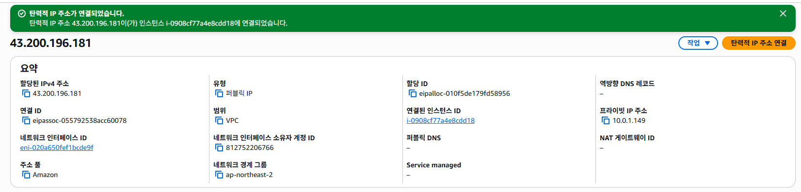
- RDS 보안그룹과 EC2보안그룹 연결
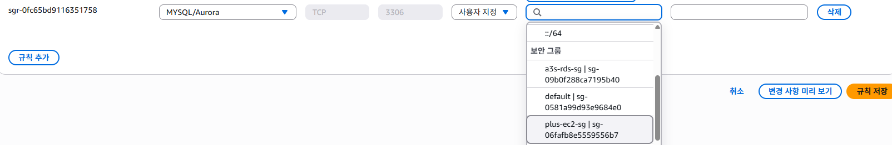
- 헬스체크 API 확인
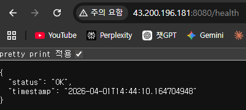
- S3 버킷 생성
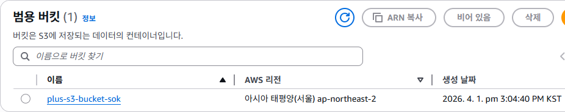
- S3 Upload
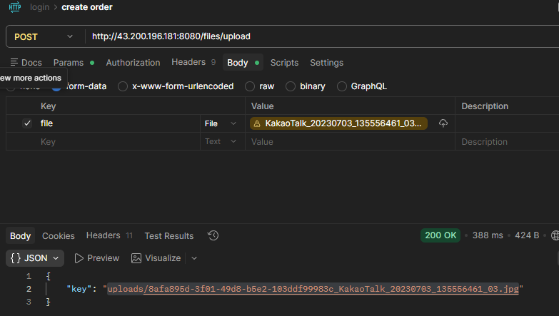
- S3 DownloadUrl (Presigned URL 적용)
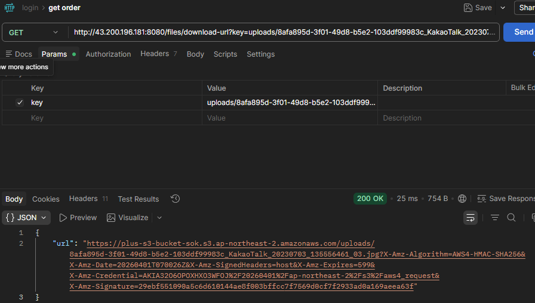
- 프로필이 잘 조회되는 모습
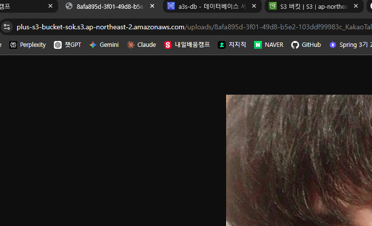

### 13. 대용량 데이터 처리
- UserBulkInsertTest로 user 더미 데이터 500만건 주입
- 닉네임 기준으로 동일한 user를 조회하는 api 구현
- 인덱스 처리 없이 단순 JPA를 활용한 조회 (2.5s)
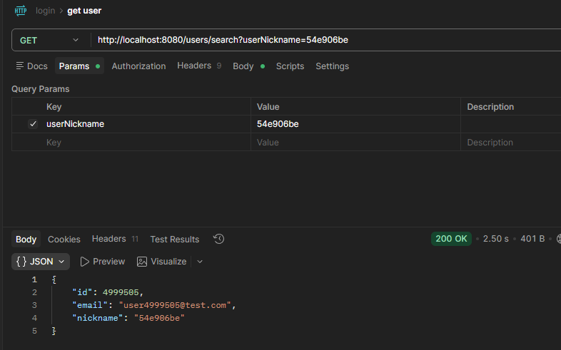
- nickname 컬럼에만 인덱스를 부여하여 단순 인덱스 적용 조회 (230ms)
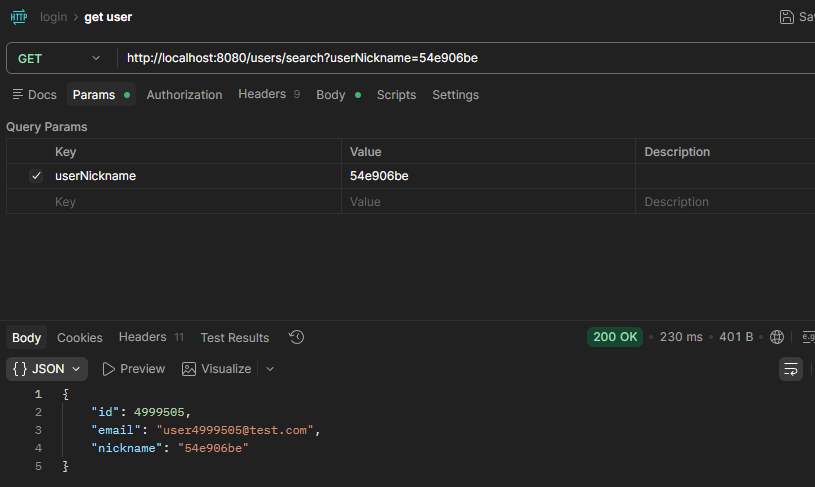
- email과 nickname에 복합(커버링) 인덱스를 부여하여 조회 (16ms)
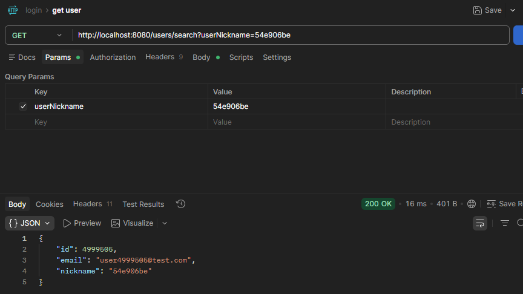
- redis 적용 후 캐싱하여 조회 (17ms)
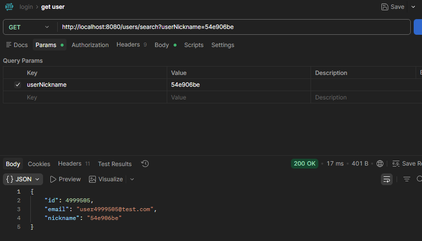
- 속도 측정 결과

| 시나리오 | 방법 | 최초 조회 | 이후 조회 | 개선율 |
|---------|------|----------|-------|--------|
| 기본 (인덱스 없음) | Full Table Scan | 2,500ms | -     | - |
| 시나리오 1 | 단일 인덱스 (nickname) | 230ms | -     | 약 90% 개선 |
| 시나리오 2 | 커버링 인덱스 (nickname + email) | 16ms | -     | 약 99% 개선 |
| 시나리오 3 | Redis 캐싱 | 2,940ms | 17ms  | 두 번째 요청부터 약 99% 개선 |

- 시나리오별 설명

#### 시나리오 1. 단일 인덱스
```sql
CREATE INDEX idx_nickname ON users (nickname);
```
**동작 방식**
- nickname 인덱스에서 대상 row의 PK를 찾은 후 실제 테이블에 접근하여 데이터를 가져옴

**장점**
- 구현이 단순하고 Full Table Scan 대비 획기적인 속도 개선이 가능
- 추가적인 인프라 없이 DB 레벨에서 해결 가능

**단점**
- 인덱스로 PK를 찾은 후 테이블에 한 번 더 접근(랜덤 I/O)하는 비용이 발생

---

#### 시나리오 2. 커버링 인덱스
```sql
CREATE INDEX idx_nickname_email ON users (nickname, email);
```
**동작 방식**
- MySQL 인덱스는 기본적으로 (인덱스 컬럼 + PK)를 함께 저장
- (nickname, email, id) 가 인덱스에 모두 포함되어 테이블 접근 없이 인덱스만으로 결과를 반환

**장점**
- 테이블 접근(랜덤 I/O)이 완전히 제거되어 단일 인덱스보다 빠름
- 추가 인프라 없이 DB 레벨에서 최상의 성능을 낼 수 있음

**단점**
- 반환해야 하는 컬럼이 늘어날수록 인덱스 크기가 커져 저장 공간 부담이 증가
- 인덱스에 포함되지 않은 컬럼이 추가되면 커버링 인덱스의 효과가 사라짐

---

#### 시나리오 3. Redis 캐싱
```java
@Cacheable(value = "users", key = "#userNickname")
public UserResponse searchUser(String userNickname) { ... }
```
**동작 방식**
- 첫 번째 요청: DB에서 조회 후 결과를 Redis에 저장
- 두 번째 요청부터: Redis에서 바로 반환 (DB 접근 없음)

**장점**
- 두 번째 요청부터 DB 접근이 완전히 제거되어 매우 빠른 응답이 가능
- 동일한 닉네임에 대한 반복 조회가 많은 환경에서 DB 부하를 획기적으로 줄일 수 있음

**단점**
- Redis라는 별도의 인프라가 필요
- 첫 번째 요청은 DB 조회 + Redis 저장으로 오히려 느릴 수 있음
- 캐시와 DB 간 데이터 정합성 관리가 필요 (유저 정보 변경 시 캐시 무효화 필요)

---

#### 결론 및 추천 전략

| 상황 | 추천 방법 |
|------|----------|
| 단순하고 빠른 개선이 필요할 때 | 커버링 인덱스 |
| 동일 닉네임 반복 조회가 많을 때 | Redis 캐싱 |
| 대규모 서비스 (실무) | 커버링 인덱스 + Redis 캐싱 병행 |